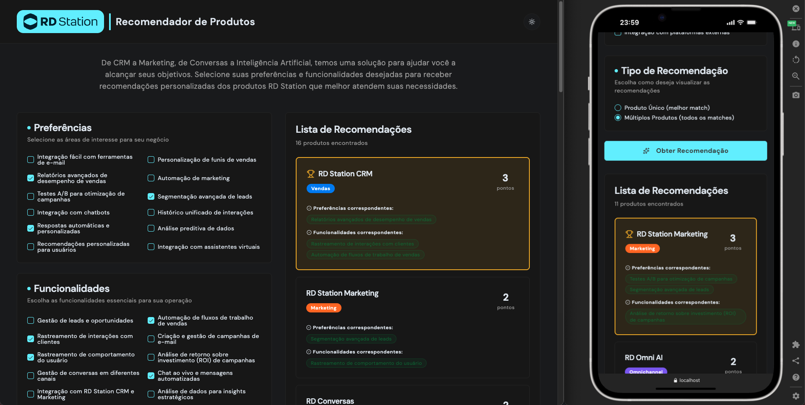

# Teste Técnico - Recomendador de Produtos RD Station

Este projeto é parte do teste técnico para a vaga de desenvolvedor front-end na RD Station. O objetivo principal é implementar a lógica de recomendação de produtos RD Station em uma aplicação web existente.

## 🎬 Demonstração


### Tema claro / Tema escuro

 

## 🚀 Como Executar o Projeto

### Pré-requisitos

- Node.js versão 18.3 ou superior
- Yarn instalado

### Instalação

1. Clone o repositório:

```bash
git clone git@github.com:laripeanuts/rdstation-challenge.git
cd rdstation-challenge
```

2. Instale as dependências:

```bash
yarn install
```

3. Execute o script de instalação:

```bash
./install.sh
```

### Variáveis de Ambiente

Para começar, copie o arquivo de exemplo e crie seu `.env` na pasta `frontend/`:

```bash
cd frontend
cp .env.example .env
```

Você pode ajustar a URL da API no `.env` (valor padrão já configurado):

```env
REACT_APP_API_URL=http://localhost:3001
REACT_APP_IS_DEVELOPMENT=true
```

**Nota:** Se não configurar, o sistema utilizará `http://localhost:3001` como padrão.

### Executando o Projeto

#### Opção 1: Frontend e Backend Simultaneamente (Recomendado)

```bash
yarn dev
```

#### Opção 2: Separadamente

```bash
# Terminal 1 - Backend
yarn start:backend

# Terminal 2 - Frontend
yarn start:frontend
```

A aplicação estará disponível em:

- **Frontend:** <http://localhost:3000>
- **Backend API:** <http://localhost:3001>

### Scripts Disponíveis

| Script                        | Descrição                                 |
| ----------------------------- | ----------------------------------------- |
| `yarn dev`                    | Inicia frontend e backend simultaneamente |
| `yarn start:frontend`         | Inicia apenas o frontend (porta 3000)     |
| `yarn start:backend`          | Inicia apenas o backend (porta 3001)      |
| `yarn lint:frontend`          | Executa ESLint no frontend                |
| `yarn lint:fix:frontend`      | Executa ESLint e corrige automaticamente  |
| `yarn test:frontend`          | Executa os testes unitários               |
| `yarn test:coverage:frontend` | Executa testes com cobertura              |
| `yarn build:frontend`         | Gera build de produção do frontend        |

## 🧠 Soluções de Lógica Implementadas

### Arquitetura Strategy Pattern

A lógica de recomendação foi implementada seguindo o padrão **Strategy**, garantindo separação de responsabilidades e alta extensibilidade.

**Fluxo de Recomendação:**

1. **Combinação de Seleções**: Preferências e features do usuário são combinadas
2. **Pontuação**: Cada produto recebe um score baseado em matches (uso de `Set` para O(1))
3. **Filtragem**: Produtos com score > 0 são ordenados por pontuação
4. **Seleção**: Estratégia de seleção é aplicada (SingleProduct/MultipleProducts)

### Estratégias Implementadas

**Scoring (Pontuação):**

- **Padrão**: +1 ponto para cada match (preferência ou feature)
- **Ponderada**: Pesos diferenciados para preferências (peso 2) vs features (peso 1)
- **Extensível**: Factory function permite criar estratégias customizadas

**Selection (Seleção):**

- **MultipleProducts**: Retorna todos os produtos pontuados ordenados
- **SingleProduct**: Retorna o melhor produto, com tie-breaking (último em caso de empate)
- **TopN**: Estratégia extensível para retornar N produtos

### Módulos Principais

| Arquivo                            | Responsabilidade                    |
| ---------------------------------- | ----------------------------------- |
| `recommendation.service.js`        | Orquestra o fluxo de recomendação   |
| `scoringStrategies.js`             | Calcula pontuações de produtos      |
| `selectionStrategies.js`           | Define quais produtos retornar      |
| `recommendationForm.validators.js` | Valida dados de entrada             |
| `useRecommendations.js`            | Hook para gerenciar recomendações   |
| `useProducts.js`                   | Hook para gerenciar produtos da API |

## 🏗️ Princípios SOLID Aplicados

| Princípio | Aplicação (no código do projeto)                                                                                                                                              |
| --------- | ----------------------------------------------------------------------------------------------------------------------------------------------------------------------------- |
| **SRP**   | Cada módulo tem uma única responsabilidade: `scoringStrategies.js` apenas pontua, `selectionStrategies.js` apenas seleciona, `recommendation.service.js` apenas orquestra.    |
| **OCP**   | Novas estratégias são adicionadas sem alterar código existente (ex.: `createWeightedScoringStrategy`, `createTopNStrategy`).                                                  |
| **LSP**   | Qualquer função que respeite a assinatura esperada substitui outra sem quebrar o fluxo: scoring `(product, selections) => number`, selection `(scoredProducts) => Product[]`. |
| **ISP**   | Dependemos de contratos mínimos (funções puras), evitando "interfaces exageradas" e acoplamentos desnecessários.                                                              |
| **DIP**   | `recommendationService.getRecommendations` recebe estratégias via `options` e usa defaults; o serviço depende de abstrações, não de implementações concretas.                 |

### Aplicação prática por princípio

- SRP: `frontend/src/strategies/scoringStrategies.js` não conhece seleção ou UI; `frontend/src/strategies/selectionStrategies.js` não conhece pontuação; `frontend/src/services/recommendation.service.js` apenas combina seleções, calcula scores e delega a seleção.
- OCP: Para um novo peso de pontuação, crie uma nova função (ex.: `createWeightedScoringStrategy`) e passe como `scoringStrategy` para o serviço; para outra forma de retorno, crie uma seleção (ex.: `createTopNStrategy`) e injete via `selectionStrategies`.
- LSP: `singleProductStrategy` e `multipleProductsStrategy` são intercambiáveis pois ambas recebem `scoredProducts` e retornam uma lista. O tie‑breaking do single mantém contrato retornando um array com 1 item (o último de maior score).
- ISP: O serviço só exige as formas de função necessárias; não há dependência em objetos com múltiplas responsabilidades.
- DIP: As dependências são passadas por parâmetro (`options`) com defaults (`defaultScoringStrategy`, `SELECTION_STRATEGIES`), permitindo mock em testes e substituição em runtime sem mudar o serviço.

**Benefícios reais no projeto:**

- ✅ Testabilidade: estratégias e serviço testados isoladamente com mocks
- ✅ Manutenibilidade: ajustes em scoring/seleção não afetam o restante
- ✅ Extensibilidade: novas regras adicionadas por composição e injeção

## 🎯 Funcionalidades

- ✅ Sistema de recomendação baseado em preferências e features
- ✅ Suporte a SingleProduct e MultipleProducts com tie-breaking
- ✅ Validação de formulário robusta
- ✅ Estratégias customizáveis (pesos, top N)
- ✅ Interface moderna com tema claro/escuro
- ✅ Design responsivo mobile-first
- ✅ 50+ testes unitários com cobertura > 80%

## 📋 Tecnologias

- **React.js** - Framework frontend
- **Tailwind CSS 4** - Estilização
- **json-server** - API mock
- **Axios** - Cliente HTTP
- **Shadcn/ui** - Componentes UI
- **Jest** - Testes unitários

## ✅ Requisitos

- [x] Implementar a lógica de recomendação de produtos com base nas preferências do usuário.
- [x] Utilizar React.js para o desenvolvimento do front-end.
- [x] Consumir a API fornecida pelo json-server para obter os dados dos produtos.
- [x] Seguir as boas práticas de desenvolvimento e organização de código.
- [x] Implementar testes unitários para as funcionalidades desenvolvidas.

## 🎯 Critérios de Aceite

1. [x] O serviço de recomendação de produtos deve ser capaz de receber as preferências e funcionalidades desejadas do usuário através de um formulário.
2. [x] O serviço deve retornar recomendações de produtos com base nas preferências e funcionalidades selecionadas pelo usuário.
3. [x] Se o tipo de recomendação selecionado for "SingleProduct", o serviço deve retornar apenas um produto que corresponda melhor às preferências e funcionalidades do usuário.
4. [x] Se o tipo de recomendação selecionado for "MultipleProducts", o serviço deve retornar uma lista de produtos que correspondam às preferências e funcionalidades do usuário.
5. [x] Em caso de empate na seleção de produtos com base nas preferências e funcionalidades do usuário, o serviço deve retornar o último produto que atende aos critérios de seleção.
6. [x] O serviço deve ser capaz de lidar com diferentes tipos de preferências e funcionalidades selecionadas pelo usuário.
7. [x] O serviço deve ser modular e facilmente extensível para futuras atualizações e adições de funcionalidades.

Certifique-se de que todos os critérios de aceite são atendidos durante o desenvolvimento do projeto.

## 🚀 Critérios extras propostos - Projeto

- [x] Corrige alguns pacotes que estavam faltando nas dependências como `concurrency` e `axios`
- [x] Adicionar estratégias extras para construir recomendações. Ex: Sistema de peso diferentes para funcionalidades e preferências
- [x] Adicionar seleções extras para construir recomendações. Ex: Pegar apenas `N` recomendações
- [x] Adicionar validação para o formulário
- [x] Aumentar a cobertura de testes do projeto para pelo menos 80%
- [x] Analisar e garantir uma boa performance da solução
- [x] Criar um client do AXIOS para centralizar a configuração de requests com variáveis de ambiente
- [x] Melhorar estrutura de pastas e organização
- [x] Implementar CI/CD com GitHub Actions (lint, testes, build)
- [x] Adicionar Git Hooks com Husky para validação pré-push
- [x] Garantir cobertura mínima de 80% via pipeline e hooks

## 🎨 Critérios extras propostos - UI/UX

- [x] Melhorias de layout e tela no geral
- [x] Mobile first com tailwind
- [x] Migrar para tailwind 4
- [x] Instalar shadcn para componentes
- [x] Aplicar RD Station fontes (DM Sans e RedHatDisplay)
- [x] Criar um switch para escolha de tema, usando contextAPI para distribuir o estado que deve ser mantido no local storage

## 🔄 CI/CD e Qualidade de Código

### Integração Contínua (GitHub Actions)

O projeto utiliza **GitHub Actions** para automatizar verificações de qualidade a cada push ou pull request. O pipeline CI executa:

1. **Instalação de dependências** (com cache do Yarn para otimização)
2. **Lint** (ESLint) - garante padrões de código
3. **Testes com cobertura mínima de 80%** - valida funcionalidades e qualidade
4. **Build de produção** - verifica se o código compila corretamente

O workflow está configurado em `.github/workflows/ci.yml` e roda automaticamente em todas as branches.

**Status do CI:** Os artefatos de cobertura são publicados automaticamente e ficam disponíveis por 30 dias.

### Git Hooks (Husky)

Para garantir qualidade antes mesmo do push, o projeto utiliza **Husky** com um hook `pre-push` que:

- 🧹 Executa lint no código
- 🧪 Roda todos os testes com verificação de cobertura
- 🚫 **Bloqueia o push se a cobertura estiver abaixo de 80%**

#### Configurando os Hooks

Após clonar o repositório e instalar as dependências, os hooks são configurados automaticamente via script `prepare`:

```bash
yarn install  # Instala dependências e configura Husky automaticamente
```

#### Como Funciona

Quando você tentar fazer `git push`, o Husky executará automaticamente:

```bash
🔍 [pre-push] Running lint and tests with coverage (frontend)
📊 Coverage threshold: ≥ 80%

🧹 Running ESLint...
✅ Lint passed

🧪 Running tests with coverage...
✅ All tests passed
✅ Coverage: 93.75% statements, 81.66% branches, 90.12% functions, 93.67% lines

✅ All checks passed! Proceeding with push...
```

Se alguma verificação falhar, o push será **bloqueado** e você verá uma mensagem de erro indicando o problema.

#### Interpretando Falhas

**Lint falhou:**

```bash
❌ Lint failed. Please fix the errors before pushing.
```

Solução: Execute `yarn lint:fix:frontend` para corrigir automaticamente ou corrija manualmente os erros apontados.

**Cobertura abaixo de 80%:**

```bash
❌ Tests or coverage threshold failed. Coverage must be ≥ 80%.
```

Solução: Adicione testes para as funcionalidades não cobertas até atingir o mínimo de 80%.

### Cobertura Mínima Exigida

O projeto exige **cobertura mínima de 80%** em todas as métricas:

- ✅ Statements: ≥ 80%
- ✅ Branches: ≥ 80%
- ✅ Functions: ≥ 80%
- ✅ Lines: ≥ 80%

Esta configuração está definida em `frontend/package.json` no campo `jest.coverageThreshold`.

## 🧪 Testes

O projeto conta com uma suíte completa de testes unitários, alcançando cobertura acima de 80% em todos os critérios estabelecidos. Os testes foram desenvolvidos utilizando **Jest** e **React Testing Library**, garantindo qualidade e confiabilidade do código.

### Cobertura de Testes

| Métrica    | Cobertura | Status |
| ---------- | --------- | ------ |
| Statements | 93.75%    | ✅     |
| Branches   | 81.66%    | ✅     |
| Functions  | 90.12%    | ✅     |
| Lines      | 93.67%    | ✅     |

### Estrutura de Testes

Os testes estão organizados seguindo a estrutura do projeto, com arquivos de teste próximos aos arquivos de produção:

- **Serviços**: Testes para lógica de negócio (`recommendation.service.test.js`, `product.service.test.js`)
- **Estratégias**: Testes para estratégias de scoring e seleção (`scoringStrategies.test.js`, `selectionStrategies.test.js`)
- **Hooks**: Testes para hooks customizados (`useRecommendations.test.js`, `useProducts.test.js`, `useForm.test.js`)
- **Componentes**: Testes para componentes React (`Form.test.js`, `RecommendationList.test.js`, etc.)
- **Validadores**: Testes para validação de dados (`recommendationForm.validators.test.js`)

### Cenários Testados

**Serviço de Recomendação:**

- ✅ Retorna produtos corretos para modo SingleProduct
- ✅ Retorna múltiplos produtos para modo MultipleProducts
- ✅ Implementa tie-breaking corretamente (último produto em caso de empate)
- ✅ Retorna array vazio quando não há matches
- ✅ Aceita estratégias customizadas de scoring e seleção

**Estratégias:**

- ✅ Scoring padrão e ponderado funcionam corretamente
- ✅ Seleção SingleProduct retorna produto com maior score
- ✅ Seleção MultipleProducts retorna todos produtos ordenados
- ✅ Factory functions criam estratégias customizadas

**Validação:**

- ✅ Valida dados do formulário corretamente
- ✅ Retorna erros apropriados para dados inválidos
- ✅ Aceita arrays vazios e valida tipo de recomendação

### Executando os Testes

```bash
# Executar todos os testes
yarn test

# Executar testes com cobertura
yarn test:coverage

# Executar testes em modo watch
yarn test --watch
```

## 📝 Autor

Desenvolvido por Larissa Rabelo

## 📄 Licença

Este projeto está licenciado sob a [Licença MIT](LICENSE).
